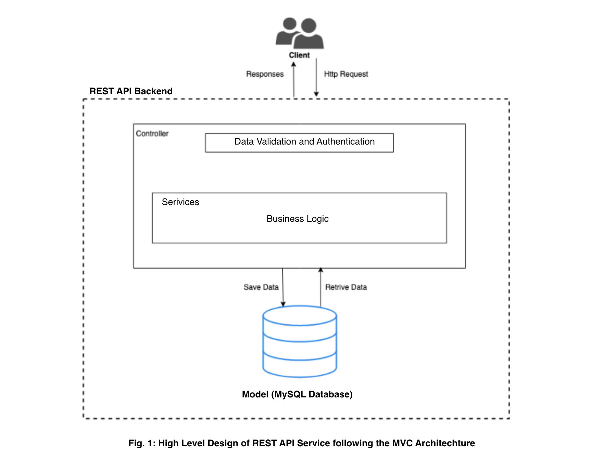
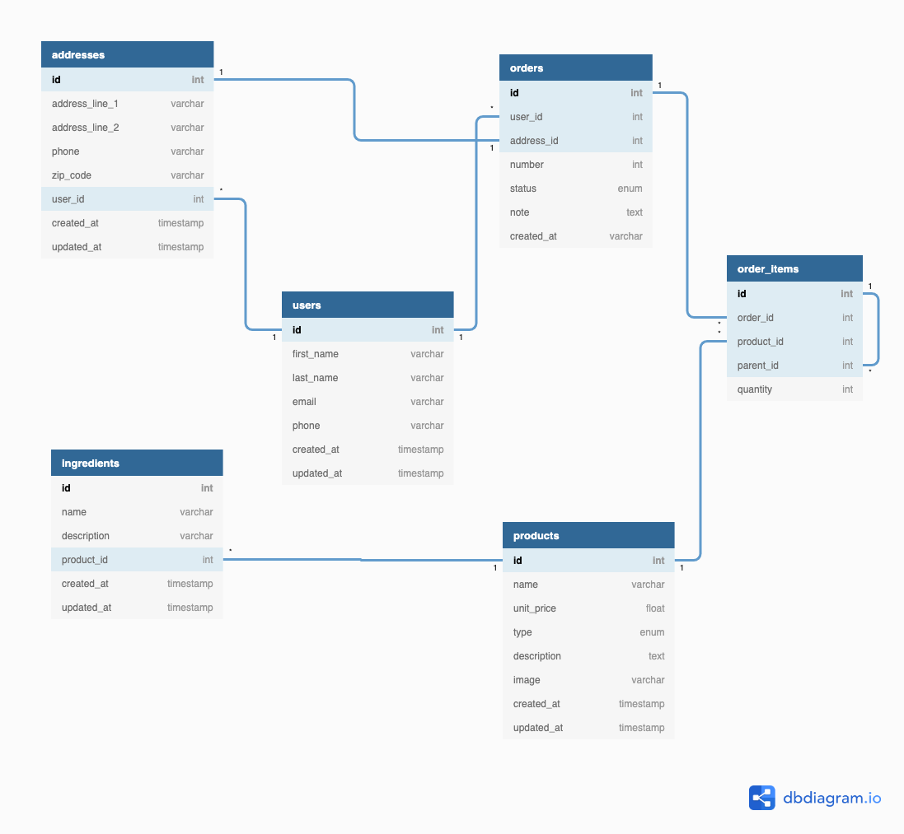

# PizzAzziP System Requirements Specification


# Introduction
This document outlines the technical and non technical requirements and specifications and considerations made in the implementation
 of a simple REST API that serves a ReactJS frontend (client). This is the backend for a pizza delivery online store. 

This document also outlines the development stack, implementation consideration, assumptions made, design consideration and reasons behind the decisions and assumptions made.

# Running the application
To run the application, make sure you already have php and composer installed. Then:
- Clone this repository (a Laravel application) 
- Install the dependencies
- Create a MySQL database
- create a `.env` file and enter your database credentials (use the example `.env.example` file)
- Run your migrations using `php artisan migrate`
- Run the seeder (`php artisan db:seed`) to populate the database with some sample data I created
- Finally, start the application with `php artisan serve`. 

If all goes well, the application should be up and running.

This REST API has been hosted on heroku here: https://pizzazzip-api.herokuapp.com

# Design and implementation Considerations

## Assumptions
In implementing this REST API, the following assumptions were made:

- Assumptions are made about the load that the system would need to handle. In a
  larger, more complex production-grade system, I would use technologies such as
  load balancing, and caching to improve performance and resilience under high
  loads
- This implementation does not focus a lot on authentication. Thus the endpoints are not secured
- Since this is a REST API service, it is stateless. This means no session is
  maintained and every request is expected to be self-contained.
- I also assume that the data to be stored is fairly small and can easily be queried at
  significantly higher speeds, thereby eliminating the need for large-scale data
  modeling techniques such as sharding (horizontal partitioning).
- Users won't log in to maintain their orders. Each order for pizzas is placed with a new address and user contact details, which are stored each time, unless if the contact details contain a existing email address or phone number.


# Technology Stack
- This is implemented using Laravel 7.0 and PHP 7.2.25, connecting to a MySQL database.

# System Architecture


## Design Architecture
 This service is implemented following the `Model View Controller (MVC)` design
 pattern, depicted in the diagram below. MVC is an architectural pattern commonly used
 for developing software systems by dividing the application into three
 parts or layers. This is done to separate internal representations of data as stored on the
 database as `Model`, from the ways information is processed following business
 requirements in the `controller` and `Services` and from how information is presented to and accepted
 from the user in the `views`. The MVC design pattern decouples these major components
 allowing for code reuse and parallel development.
 
 

## Relational Database Model
To implement this task I needed to  model and store information about the following entities
 - Products
 - Product Ingredients
 - Users
 - Addresses
 - Orders
 - Order Items (Notice from the diagram that this entity has a self, one-to-many relationship. This represents a Pizza and its toppings)

 The attributes of these entities and relationships to each other can be seen in the following entity relationship diagram (ERD)

 


# API Design and documentation
## Data Representation
The format of data used in communication with the API is JSON.
I adopt a standard format for representing all response data sent from the service.
The responses objects will be made of 3 main attributes:
1. A status: An HTTP status code for the response
2. A message: A text describing the response
3. Data: An object containing the body of the response. This further contains
sub objects or lists, depending on the nature of the data being returned.
Sample response data:

```
{
    "status": "2xx - 5xx",
    "message": "A response message"
    "data": {
        ...
    }
}
```
## API documentation 
`(Many more Endpoints were implemented but I only document those that were used in the frontend)`

A more detailed documentation of each endpoint can be found [here](https://documenter.getpostman.com/view/10717842/Szt8eVsN).
This section only provides a high level overview of the endpoints provided by the
service. 

<table>
    <thead>
        <tr>
            <td>METHOD</td>
            <td>URI</td>
            <td>DESCRIPTION</td>
        </tr>
    </thead>
    <tbody>
        <tr>
            <td>GET</td>
            <td>/api/products</td>
            <td>Retrieves a paginated list of products</td>
        </tr>
        <tr>
            <td>POST</td>
            <td>/api/products</td>
            <td>Creates a new product (see detailed documentation for payload) </td>
        </tr> 
        <tr>
            <td>GET</td>
            <td>/api/products/:id</td>
            <td>Retrieves a single product by its id</td>
        </tr>
        <tr>
            <td>DELETE</td>
            <td>/api/products/:id</td>
            <td>Deletes a single product by its id</td>
        </tr>
        <tr>
            <td>GET</td>
            <td>/api/orders</td>
            <td>Retrieves a paginated list of orders</td>
        </tr>
        <tr>
            <td>POST</td>
            <td>/api/orders</td>
            <td>Creates a new order (see detailed documentation for payload) </td>
        </tr> 
        <tr>
            <td>GET</td>
            <td>/api/orders/:id</td>
            <td>Retrieves a single order by its id</td>
        </tr>
        <tr>
            <td>DELETE</td>
            <td>/api/orders/:id</td>
            <td>Deletes a single order by its id</td>
        </tr>
    </tbody>
    
</table>

## Limitations
- Filtering by query parameters is not implemented.
- Data is not validated (I assume that data being sent to the API is valid and invalid data will lead to errors at the level of teh database)
- The endpoints are not secured, though this can easily be achieve with jwt

# Non Functional Requirements
## Usability
Because this is only the REST API service and not a monolith, it is difficult to use without a user friendly client (frontend), 
The backend alone is not very user friendly and requires to level of technicality to be used. However, this task has a corresponding frontend implemented in react. That codebase can be found [here](https://github.com/TeyimPila/pizzazzip-web)


## Security
For the purpose of this task and with the limited time, security wasn’t fully put into consideration.
However, security can be achieved using a JWT that as an expiry duration and a refresh token.
User authentication and authorization can also be implemented. 

## Data Transfer
Data is transferred between the client and the server over https, with JSON being the format in which
the data is transferred.

## Supportability and Extensibility
The code can easily be managed and extended to add new features. This is made possible by my
observation of some key software engineering principles such as Single responsibility principle, DRY,
proper documentation, the MVC architecture, and overall code simplicity.

# Further Improvements
- Implement transaction management to prevent inconsistencies in the database
- Implement proper security
- Update endpoints to handle query parameters
- Data validation for all requests to the endpoint
- Respond to failed requests with proper JSON responses instead of a crash page.
- Dockerize the project to allow easy running in a self contained container.
- Write unit and integration tests
- Make use of environment variable to store confidential information such as database credentials

# Challenges
- Sticking to strict git flow was an issue since this being a new project, almost everything depended on many other things. But once the initial setup, configuration were done, clear boundaries could easily be set between tasks and implemented, each on their own branch
- After hosting, I faced serious challenges with speed. This resulted from bandwidth limiations set my db4free.net. Changing to a new database host fixed this.
